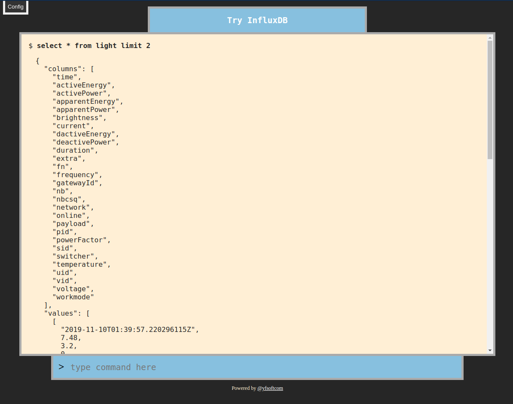
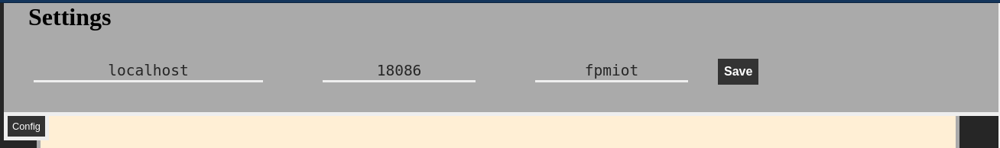

# Try Influx

A GUI for execute influxQL.

It's made by angular 8.

The main UI.



The setting pannel, click the `Config` button on the top-left of the page to toggle it.



#### Run with docker

```bash
$ docker run -p 8080:80 -d yfsoftcom/try-influx 
```

#### Enjoy it

Open [http://localhost:8080](http://localhost:8080)


#### InfluxQL

Get more influxQL from [https://docs.influxdata.com/influxdb/v1.7/query_language/](https://docs.influxdata.com/influxdb/v1.7/query_language/)
